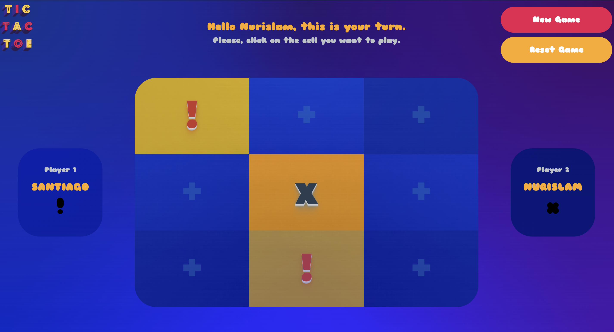

# Tic tac toe - A Microverse educational project

Building a Tic Tac Toe game using JavaScript to build the entire game manipulating DOM elements using JS modules.

## Built With

-   HTML5;
-   CSS3;
-   Javascript.

## Live Demo

[Live Demo](https://raw.githack.com/nurislam-ab/tic-tac-toe-js/feature-develop-game/index.html)

## Getting Started

- Fork the repository and create a local one on your computer;
- Move to the repository inside the command line using `cd` and the path to the file;
- open `index.html` file on your browser.

## Authors

👤 Nurislam Ab
- Github: [@nurislam-ab](https://github.com/nurislam-ab)
- Twitter: [@NurislamAb](https://twitter.com/NurislamAb)
- Linkedin: [nurislam-ab](https://www.linkedin.com/in/nurislam-ab/)

👤 Santiago Rodriguez
- Github: [@santiagorodriguezbermudez](https://github.com/santiagorodriguezbermudez)
- Twitter: [@srba87](https://twitter.com/srba87)
- Linkedin: [srba87](https://linkedin.com/in/srba)

## 🤝 Contributing

Contributions, issues, and feature requests are welcome!

## 📝 License

This project is [MIT](LICENSE) licensed.